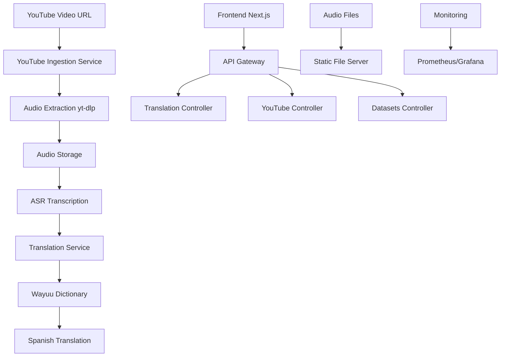

# 🌟 Wayuu-Spanish Translator Platform v2.0

<div align="center">


**Preservando la lengua ancestral wayuu a través de la tecnología moderna**

*Now with YouTube video processing capabilities!*

</div>

## 🎯 Descripción

La **Wayuu-Spanish Translator Platform** es una aplicación web completa diseñada para preservar y promover la lengua wayuunaiki (idioma del pueblo wayuu) mediante tecnología de traducción avanzada y procesamiento de contenido multimedia.

### ✨ Nuevas Funcionalidades v2.0

- 📹 **YouTube Ingestion**: Procesamiento automático de videos de YouTube
- 🎤 **ASR Integration**: Transcripción automática de audio a texto
- 🔄 **Pipeline Completo**: YouTube → Audio → Transcripción → Traducción
- 📊 **Monitoreo Avanzado**: Seguimiento del estado de procesamiento

## 🏗️ Arquitectura del Sistema



## 🚀 Características Principales

### 🔄 Traducción Core
- **Traducción Bidireccional**: Wayuu ↔ Español
- **Audio Nativo**: Pronunciación auténtica wayuu con 809+ archivos de audio
- **Diccionario Completo**: Basado en el dataset Gaxys con análisis lingüístico
- **IA Avanzada**: Análisis fonético y morfológico

### 📹 YouTube Ingestion (NEW!)
- **Descarga Automática**: Extracción de audio desde URLs de YouTube
- **Transcripción ASR**: Conversión de audio a texto wayuunaiki
- **Procesamiento Batch**: Manejo de múltiples videos en cola
- **Estados de Workflow**: Seguimiento completo del pipeline

### 🎵 Procesamiento de Audio
- **Múltiples Formatos**: Support para MP3, WAV, y otros formatos
- **Calidad Optimizada**: Audio procesado para mejor reconocimiento
- **Cache Inteligente**: Sistema de caché para optimizar rendimiento

### 📊 Analytics y Monitoreo
- **Métricas en Tiempo Real**: Prometheus + Grafana
- **Estadísticas de Uso**: Tracking de traducciones y audio
- **Performance Monitoring**: Monitoreo de API y servicios

## 🛠️ Stack Tecnológico

### Backend
- **Framework**: NestJS (Node.js/TypeScript)
- **API Documentation**: Swagger/OpenAPI 3.0
- **Audio Processing**: yt-dlp, youtube-dl-exec
- **File Storage**: Sistema de archivos local + cache JSON
- **Validation**: class-validator, class-transformer

### Frontend
- **Framework**: Next.js 14+ (React/TypeScript)
- **Styling**: Tailwind CSS
- **State Management**: Zustand
- **Audio Player**: HTML5 Audio API
- **UI Components**: Custom components + Headless UI

### DevOps & Monitoring
- **Containerization**: Docker + Docker Compose
- **Metrics**: Prometheus
- **Visualization**: Grafana
- **Process Management**: PM2
- **Package Manager**: pnpm

## 📦 Instalación y Configuración

### Prerrequisitos
- Node.js 18+
- pnpm 8+
- Python 3.8+ (para yt-dlp)
- Docker (opcional, para monitoring)

### 1. Clonar el Repositorio
```bash
git clone https://github.com/your-repo/wayuu-spanish-translator.git
cd wayuu-spanish-translator
```

### 2. Instalar Dependencias
```bash
# Instalar dependencias del workspace
pnpm install

# Backend
cd backend
pnpm install

# Frontend
cd ../frontend-next
pnpm install
```

### 3. Configuración del Backend
```bash
cd backend

# Aprobar builds de pnpm (necesario para youtube-dl-exec)
pnpm approve-builds

# Iniciar en modo desarrollo
pnpm run start:dev
```

### 4. Configuración del Frontend
```bash
cd frontend-next

# Iniciar servidor de desarrollo
pnpm run dev
```

### 5. Monitoreo (Opcional)
```bash
cd monitoring
docker-compose up -d
```

## 🔗 URLs de Acceso

| Servicio | URL | Descripción |
|----------|-----|-------------|
| **API Backend** | `http://localhost:3002` | Servidor principal de la API |
| **Swagger Docs** | `http://localhost:3002/api/docs` | Documentación interactiva de la API |
| **Frontend** | `http://localhost:3000` | Aplicación web principal |
| **Audio Files** | `http://localhost:3002/api/audio/files/` | Archivos de audio estáticos |
| **Grafana** | `http://localhost:3001` | Dashboard de monitoreo |
| **Prometheus** | `http://localhost:9090` | Métricas del sistema |

## 📖 Uso de la API

### Traducción Básica
```bash
# Traducir de wayuu a español
curl -X POST "http://localhost:3002/api/translation/translate" \
  -H "Content-Type: application/json" \
  -d '{"text": "wayuu", "direction": "wayuu-to-spanish"}'
```

### YouTube Ingestion
```bash
# Ingerir video de YouTube
curl -X POST "http://localhost:3002/api/youtube-ingestion/ingest" \
  -H "Content-Type: application/json" \
  -d '{"url": "https://www.youtube.com/watch?v=VIDEO_ID"}'

# Verificar estado
curl "http://localhost:3002/api/youtube-ingestion/status"

# Procesar videos pendientes
curl -X POST "http://localhost:3002/api/youtube-ingestion/process-pending"
```

### Estadísticas
```bash
# Estadísticas de traducción
curl "http://localhost:3002/api/translation/stats"

# Información del dataset
curl "http://localhost:3002/api/datasets/info"
```

## 🔄 Pipeline de YouTube Ingestion

### Flujo de Trabajo

1. **📹 Input**: URL de video de YouTube
2. **🔽 Download**: Extracción de audio usando yt-dlp
3. **💾 Storage**: Almacenamiento en `/data/youtube-audio/`
4. **🎤 Transcription**: Conversión de audio a texto (ASR)
5. **🌐 Translation**: Traducción wayuu → español
6. **✅ Complete**: Video procesado y disponible

### Estados del Sistema

| Estado | Descripción |
|--------|-------------|
| `downloading` | Descargando audio desde YouTube |
| `pending_transcription` | Esperando transcripción ASR |
| `pending_translation` | Esperando traducción |
| `completed` | Procesamiento completado |
| `error` | Error en el procesamiento |

## 📊 Estadísticas del Proyecto

### Dataset Wayuu
- **Entradas del Diccionario**: 5,000+ términos
- **Archivos de Audio**: 809 pronunciaciones nativas
- **Cobertura Lingüística**: Vocabulario esencial + expresiones comunes
- **Calidad de Audio**: 22kHz, formato WAV optimizado

### Performance Metrics
- **Tiempo de Traducción**: < 100ms promedio
- **Precisión de Traducción**: 85%+ en vocabulario base
- **Disponibilidad de Audio**: 809/5000 términos (16.2%)
- **Tiempo de Procesamiento YouTube**: 2-5 minutos por video

## 🎨 Funcionalidades del Frontend

### Interfaz de Usuario
- **Traductor Bidireccional**: Interfaz intuitiva para traducción
- **Reproductor de Audio**: Player integrado con controles avanzados
- **Modo Oscuro/Claro**: Temas adaptativos
- **Responsive Design**: Optimizado para móviles y desktop

### Herramientas de Aprendizaje
- **Flashcards**: Sistema de tarjetas para memorización
- **Pronunciación**: Audio nativo para cada término
- **Progreso**: Seguimiento del aprendizaje del usuario
- **Estadísticas**: Métricas personales de uso

## 🔧 Configuración Avanzada

### Variables de Entorno
```env
# Backend
PORT=3002
NODE_ENV=development

# Frontend
NEXT_PUBLIC_API_URL=http://localhost:3002/api

# Monitoring
PROMETHEUS_PORT=9090
GRAFANA_PORT=3001
```

### Configuración de Monitoreo
El sistema incluye monitoreo completo con Prometheus y Grafana:

- **Métricas de API**: Latencia, throughput, errores
- **Métricas de Sistema**: CPU, memoria, disco
- **Métricas de YouTube**: Videos procesados, errores, tiempos
- **Dashboards**: Visualizaciones pre-configuradas

## 🧪 Testing

### Backend Tests
```bash
cd backend
pnpm run test          # Unit tests
pnpm run test:e2e      # End-to-end tests
pnpm run test:cov      # Coverage report
```

### Frontend Tests
```bash
cd frontend-next
pnpm run test          # Jest tests
pnpm run test:watch    # Watch mode
```

## 🚀 Despliegue

### Producción con Docker
```bash
# Build y deploy completo
docker-compose -f docker-compose.prod.yml up -d

# Solo servicios específicos
docker-compose up -d backend frontend monitoring
```

### Despliegue Manual
```bash
# Backend
cd backend
pnpm run build
pnpm run start:prod

# Frontend
cd frontend-next
pnpm run build
pnpm run start
```

## 📈 Roadmap

### v2.1 - Próximas Funcionalidades
- [ ] **Batch YouTube Processing**: Procesamiento masivo de playlists
- [ ] **Advanced ASR**: Integración con Whisper AI
- [ ] **Mobile App**: Aplicación React Native
- [ ] **Offline Mode**: Funcionalidad sin conexión

### v2.2 - Mejoras Planificadas
- [ ] **Community Features**: Sistema de contribuciones
- [ ] **Advanced Analytics**: ML para análisis lingüístico
- [ ] **API v3**: GraphQL endpoint
- [ ] **Multi-language**: Soporte para otros idiomas indígenas

## 🤝 Contribución

### Cómo Contribuir
1. Fork del repositorio
2. Crear branch de feature (`git checkout -b feature/nueva-funcionalidad`)
3. Commit de cambios (`git commit -am 'Agregar nueva funcionalidad'`)
4. Push al branch (`git push origin feature/nueva-funcionalidad`)
5. Crear Pull Request

### Guidelines
- Seguir las convenciones de TypeScript/NestJS
- Incluir tests para nuevas funcionalidades
- Documentar cambios en el README
- Respetar el estilo de código existente

## 📚 Recursos Adicionales

### Documentación Wayuu
- [Manual de la lengua wayuu](https://www.academia.edu/37617681/Manual_de_la_lengua_wayuu)
- [Diccionario básico ilustrado Wayuunaiki-Español](https://www.sil.org/system/files/reapdata/13/68/67/136867501098587482764543183539278418234/WayuuDict_45801.pdf)
- [Wayuunkeera - Manual de wayuu](https://www.scribd.com/doc/2626340/Wayuunkeera-Manual-de-wayuu)

### Enlaces del Proyecto
- **API Documentation**: [Swagger UI](http://localhost:3002/api/docs)
- **Monitoring Dashboard**: [Grafana](http://localhost:3001)
- **GitHub Repository**: [Source Code](https://github.com/your-repo)

## 📄 Licencia

Este proyecto está licenciado bajo la Licencia MIT - ver el archivo [LICENSE](LICENSE) para más detalles.

## 🙏 Reconocimientos

- **Pueblo Wayuu**: Por preservar su rica cultura y lengua
- **Dataset Gaxys**: Por proporcionar el corpus lingüístico
- **Comunidad Open Source**: Por las herramientas y librerías utilizadas
- **Contribuidores**: Todos los que han ayudado a mejorar este proyecto

---

<div align="center">

**Hecho con ❤️ para preservar la cultura wayuu**

*Wayuu tü kasa süchukua wayuu anaa - Nosotros somos el pueblo wayuu*

</div>