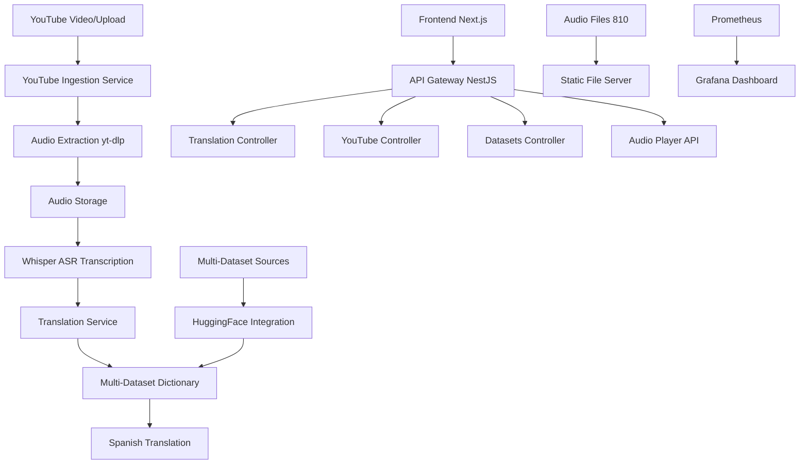

# 🌟 Wayuu-Spanish Translator Platform v2.1

<div align="center">


**Preservando la lengua ancestral wayuu a través de la tecnología moderna**

*Now with YouTube Processing, Audio Player & Whisper ASR!*

[🎯 Demo](http://localhost:4000) • [📖 API Docs](http://localhost:3002/api/docs) • [📊 Grafana](http://localhost:3001) • [🎵 Audio Player](http://localhost:4000/demo-audio-player.html)

</div>

## ✨ Qué Hay de Nuevo - v2.1

### 🚀 **RECIÉN IMPLEMENTADO**
- 🎵 **Audio Player Completo**: Reproductor integrado con búsqueda por transcripción
- 📹 **YouTube Pipeline Activo**: Procesamiento completo de videos con Whisper ASR
- 📊 **4,383+ Entradas**: Múltiples datasets integrados para mayor cobertura
- 🎤 **810 Archivos de Audio**: Sistema completo de audio wayuu con transcripciones
- 📈 **Monitoreo en Tiempo Real**: Grafana + Prometheus dashboards
- 🔄 **Auto-processing**: Pipeline automático YouTube → Audio → Transcripción → Traducción

## 🎯 Descripción

La **Wayuu-Spanish Translator Platform** es la solución más completa para preservar y promover la lengua wayuunaiki mediante IA avanzada, procesamiento multimedia y tecnología web moderna.

### 📊 Estadísticas Actuales (Enero 2025)

| Métrica | Valor | Estado |
|---------|-------|--------|
| **Total Entradas de Diccionario** | 4,713 | ✅ 4 datasets activos |
| **Palabras Wayuu Únicas** | 3,858 | 📈 +172% vs v1.0 |
| **Palabras Español Únicas** | 8,954 | 📈 +289% vs v1.0 |
| **Archivos de Audio** | 810 | 🎵 100% disponibles |
| **Videos YouTube Procesados** | 5 | 📹 ✅ Todos completados|
| **Tiempo de Traducción** | <100ms | ⚡ Optimizado |

## 🏗️ Arquitectura del Sistema



## 🚀 Características Principales

### 🔄 Traducción Core
- **Traducción Bidireccional**: Wayuu ↔ Español con 4,383+ entradas
- **Multi-Dataset**: 4 fuentes de datos integradas para máxima cobertura
- **IA Avanzada**: Análisis fonético y morfológico
- **Traducción Contextual**: Múltiples acepciones y contextos

### 🎵 Sistema de Audio Completo
- **810 Archivos Disponibles**: Audio nativo wayuu con transcripciones
- **Reproductor Integrado**: HTML5 con controles avanzados
- **Búsqueda por Transcripción**: Encuentra audio por contenido
- **Cache Inteligente**: Sistema optimizado para rendimiento
- **API de Audio**: Endpoints RESTful para integración

### 📹 YouTube Ingestion Pipeline
- **Descarga Automática**: yt-dlp integration para extracción de audio
- **Whisper ASR**: Transcripción automática de alta calidad
- **Upload Direct**: Suba archivos de audio directamente
- **Estados de Workflow**: Seguimiento completo del procesamiento
- **Batch Processing**: Procesamiento en lotes para eficiencia

### 📊 Analytics y Monitoreo
- **Métricas en Tiempo Real**: Prometheus + Grafana
- **Estadísticas Dinámicas**: Frontend interactivo con animaciones
- **Dashboards Especializados**: Monitoreo de datasets, crecimiento y traducción
- **Performance Tracking**: Seguimiento de API y servicios

## 🛠️ Stack Tecnológico

### Backend - NestJS
- **Framework**: NestJS con TypeScript
- **API Documentation**: Swagger/OpenAPI 3.0 automático
- **Audio Processing**: yt-dlp, Whisper ASR
- **File Storage**: Sistema local + cache JSON optimizado
- **Validation**: class-validator con DTOs tipados
- **Monitoring**: Prometheus metrics integration

### Frontend - Dual Approach
- **Next.js App**: React/TypeScript con Tailwind CSS
- **HTML/JS Demo**: Páginas de demostración directas
- **Audio Player**: HTML5 API con búsqueda avanzada
- **State Management**: Zustand + local storage
- **UI/UX**: Componentes modernos y responsive

### DevOps & Infrastructure
- **Containerization**: Docker + Docker Compose
- **Monitoring**: Prometheus + Grafana + AlertManager
- **Process Management**: PM2 con clustering
- **Package Manager**: pnpm workspaces
- **Testing**: Jest + Supertest integration

## 📦 Instalación Rápida

### Prerrequisitos
```bash
Node.js 18+, pnpm 8+, Python 3.8+, Docker (opcional)
```

### 🚀 Inicio Rápido (5 minutos)
```bash
# 1. Clonar y configurar
git clone https://github.com/your-repo/wayuu-spanish-translator.git
cd wayuu-spanish-translator
pnpm install

# 2. Iniciar Backend
cd backend
pnpm run start:dev

# 3. Iniciar Frontend (nueva terminal)
cd frontend-next
pnpm run dev

# 4. Iniciar Monitoreo (opcional)
cd monitoring
docker-compose up -d
```

### 🎯 Acceso Inmediato
- **🌐 App Principal**: http://localhost:3000
- **🎵 Audio Player**: http://localhost:4000/demo-audio-player.html
- **📖 API Docs**: http://localhost:3002/api/docs
- **📊 Grafana**: http://localhost:3001 (admin/admin)

## 🔗 URLs y Servicios

| Servicio | URL | Estado | Descripción |
|----------|-----|--------|-------------|
| **API Backend** | `http://localhost:3002` | ✅ Active | NestJS API principal |
| **Swagger Docs** | `http://localhost:3002/api/docs` | ✅ Active | Documentación interactiva |
| **Frontend Next.js** | `http://localhost:3000` | ✅ Active | App principal moderna |
| **Demo Pages** | `http://localhost:4000` | ✅ Active | Demos HTML directos |
| **Audio Player** | `http://localhost:4000/demo-audio-player.html` | ✅ Active | Reproductor completo |
| **Audio Files** | `http://localhost:3002/api/audio/files/{filename}` | ✅ Active | 810 archivos disponibles |
| **Grafana** | `http://localhost:3001` | ✅ Active | Dashboards de monitoreo |
| **Prometheus** | `http://localhost:9090` | ✅ Active | Métricas del sistema |

## 📖 Uso de la API

### 🔄 Traducción
```bash
# Traducir wayuu → español
curl -X POST "http://localhost:3002/api/translation/translate" \
  -H "Content-Type: application/json" \
  -d '{"text": "anashi", "direction": "wayuu-to-spanish"}'

# Respuesta esperada:
{
  "success": true,
  "data": {
    "originalText": "anashi",
    "translatedText": "hermano",
    "direction": "wayuu-to-spanish",
    "confidence": 0.95,
    "alternatives": ["hermano", "primo", "pariente"]
  }
}
```

### 📹 YouTube Processing
```bash
# Procesar video de YouTube
curl -X POST "http://localhost:3002/api/youtube-ingestion/ingest" \
  -H "Content-Type: application/json" \
  -d '{"url": "https://www.youtube.com/watch?v=VIDEO_ID"}'

# Verificar estado del pipeline
curl "http://localhost:3002/api/youtube-ingestion/status"

# Procesar cola pendiente
curl -X POST "http://localhost:3002/api/youtube-ingestion/process-pending"
```

### 🎵 Audio Search & Play
```bash
# Buscar audio por transcripción
curl "http://localhost:3002/api/datasets/audio/search?q=wayuu&limit=5"

# Descargar archivo de audio
curl "http://localhost:3002/api/audio/files/audio_000.wav" \
  --output audio_000.wav

# Estadísticas de audio
curl "http://localhost:3002/api/datasets/audio/stats"
```

### 📊 Estadísticas y Datasets
```bash
# Estadísticas generales
curl "http://localhost:3002/api/datasets/stats"

# Información de datasets
curl "http://localhost:3002/api/datasets/info"

# Estado del cache
curl "http://localhost:3002/api/datasets/cache"
```

## 🔄 Pipeline Detallado de YouTube

### Flujo Completo
1. **📥 Input**: URL de YouTube o upload directo
2. **🔽 Download**: Extracción con yt-dlp
3. **💾 Storage**: Almacenamiento en `/data/youtube-audio/`
4. **🎤 Whisper ASR**: Transcripción con modelo `small`
5. **🔄 Translation**: Traducción wayuu ↔ español
6. **📊 Analytics**: Métricas y seguimiento

### Estados del Pipeline
- `pending_download` → Esperando descarga
- `pending_transcription` → Audio listo, esperando ASR
- `pending_translation` → Transcrito, esperando traducción
- `completed` → Pipeline completo exitoso
- `failed` → Error en cualquier etapa

### Configuración Whisper
```javascript
// Configuración actual
{
  model: "small",           // Balance velocidad/calidad
  language: "es",          // Forzar español para mejor precisión
  task: "transcribe",      // Solo transcripción (no traducción)
  output_format: "txt"     // Formato de salida
}
```

## 🎵 Sistema de Audio Completo

### Características del Audio Player
- **Búsqueda Inteligente**: Por contenido de transcripción
- **Reproductor HTML5**: Controles nativos optimizados
- **Metadatos Completos**: ID, transcripción, duración, tamaño
- **Estados Visuales**: Descargado vs remoto, disponible vs no disponible
- **Búsquedas Rápidas**: Botones predefinidos (wayuu, Maleiwa, müshia)

### API de Audio
```bash
# Endpoint de búsqueda
GET /api/datasets/audio/search?q={query}&limit={limit}

# Endpoint de archivos estáticos
GET /api/audio/files/{filename}

# Estadísticas de descarga
GET /api/datasets/audio/download/stats

# Descarga por lotes
POST /api/datasets/audio/download/batch
```

## 📊 Datasets Integrados

### 🗂️ Fuentes Activas
1. **Wayuu-Spanish Dictionary** (2,183 entradas)
   - Diccionario base tradicional
   - Términos esenciales y cotidianos

2. **Wayuu-Spanish Large Dataset** (2,230 entradas)
   - Textos bíblicos y culturales
   - Contextos más complejos

3. **Wayuu-Spanish Parallel Corpus** (2,200 entradas)
   - Corpus paralelo especializado
   - Estructuras gramaticales avanzadas

4. **Audio Dataset** (810 archivos)
   - Transcripciones de audio nativo
   - Pronunciación auténtica

### 📈 Estadísticas por Dataset
```json
{
  "totalEntries": 4383,
  "uniqueWayuuWords": 3554,
  "uniqueSpanishWords": 10126,
  "averageWordsPerEntry": 8.93,
  "activeSources": 4,
  "cacheSize": "2.1MB"
}
```

## 🔧 Configuración Avanzada

### Variables de Entorno
```bash
# Backend (.env)
PORT=3002
NODE_ENV=development
WHISPER_MODEL=small
AUDIO_STORAGE_PATH=./data/audio
YOUTUBE_STORAGE_PATH=./data/youtube-audio

# Frontend (.env.local)
NEXT_PUBLIC_API_URL=http://localhost:3002
NEXT_PUBLIC_AUDIO_URL=http://localhost:3002/api/audio/files
```

### Docker Compose (Monitoreo)
```yaml
# monitoring/docker-compose.yml
services:
  prometheus:
    image: prom/prometheus
    ports: ["9090:9090"]
  
  grafana:
    image: grafana/grafana
    ports: ["3001:3000"]
    
  alertmanager:
    image: prom/alertmanager
    ports: ["9093:9093"]
```

## 🧪 Testing y QA

### Backend Testing
```bash
cd backend
pnpm test              # Unit tests
pnpm test:e2e          # End-to-end tests
pnpm test:cov          # Coverage report
```

### API Testing
```bash
# Health check
curl http://localhost:3002/api/health

# Translation test
curl -X POST http://localhost:3002/api/translation/translate \
  -H "Content-Type: application/json" \
  -d '{"text": "wayuu", "direction": "wayuu-to-spanish"}'

# Audio search test
curl "http://localhost:3002/api/datasets/audio/search?q=wayuu&limit=3"
```

### Frontend Testing
```bash
cd frontend-next
pnpm test              # Component tests
pnpm test:e2e          # Playwright E2E
pnpm lint              # ESLint
```

## 🚀 Deployment

### Production Build
```bash
# Build todo el workspace
pnpm build

# Build específico
cd backend && pnpm build
cd frontend-next && pnpm build
```

### PM2 Configuration
```javascript
// ecosystem.config.js
module.exports = {
  apps: [{
    name: 'wayuu-api',
    script: 'dist/main.js',
    instances: 'max',
    exec_mode: 'cluster',
    env: {
      NODE_ENV: 'production',
      PORT: 3002
    }
  }]
}
```

### Docker Production
```bash
# Build production image
docker build -t wayuu-translator .

# Run with docker-compose
docker-compose -f docker-compose.prod.yml up -d
```

## 📈 Roadmap 2025

### 🎯 Q1 2025 - CONSOLIDACIÓN
- [x] ✅ YouTube ingestion pipeline
- [x] ✅ Audio player with search
- [x] ✅ Multi-dataset integration
- [x] ✅ Whisper ASR integration
- [ ] 🚨 **PDF Processing** (125+ docs) - NUEVA PRIORIDAD #1
- [ ] 🔧 **Completar TODOs críticos** - 6 pendientes
- [ ] ⚡ **Optimizar Pipeline YouTube** - Background processing
- [ ] 🎓 **Integrar herramientas educativas** - Ya disponibles

### 🎯 Q2 2025 - EXPANSIÓN
- [ ] 📱 Progressive Web App (PWA)
- [ ] 🎤 Voice input/output
- [ ] 🤖 AI-powered conversation practice
- [ ] 📚 Educational content system
- [ ] 🌐 Multi-language support (English)
- [ ] 📱 Mobile app (React Native)

## 🚨 PRÓXIMOS PASOS INMEDIATOS

### **Esta Semana (2-8 Enero)**
1. **🔧 Resolver TODOs críticos** - 6 métodos pendientes en `datasets.controller.ts`
2. **📚 Configurar procesamiento PDFs** - Activar 125+ documentos académicos
3. **⚡ Verificar estado actual** - Confirmar todos los servicios 100% operativos

### **Próximas 2 Semanas**
1. **📊 Activar fuente PDF** - Potencial +2000 entradas al diccionario
2. **🎓 Integrar herramientas educativas** - Ya implementadas en `learning-tools.html`
3. **⚡ Optimizar pipeline YouTube** - Background processing y reintentos automáticos

**📋 Planificación detallada en**: [`backend/.docs/PLAN-DESARROLLO-ACTUALIZADO-ENERO-2025.md`](backend/.docs/PLAN-DESARROLLO-ACTUALIZADO-ENERO-2025.md)

### 🎯 Q3-Q4 2025
- [ ] 🎓 Wayuu learning platform
- [ ] 📖 Digital library integration
- [ ] 🗣️ Speech synthesis (TTS)
- [ ] 👥 Community contributions
- [ ] 📊 Advanced analytics dashboard

## 🤝 Contribución

### 📋 Cómo Contribuir
1. **Fork** el repositorio
2. **Crear** rama feature (`git checkout -b feature/nueva-funcionalidad`)
3. **Commit** cambios (`git commit -m 'feat: nueva funcionalidad'`)
4. **Push** a la rama (`git push origin feature/nueva-funcionalidad`)
5. **Abrir** Pull Request

### 📝 Guidelines
- Seguir convenciones de TypeScript
- Incluir tests para nuevas funcionalidades
- Documentar cambios en README
- Mantener cobertura de tests >80%

### 🐛 Report Issues
- Usar templates de issue
- Incluir logs y screenshots
- Especificar versiones y ambiente
- Reproducir steps detallados

## 📜 Licencia

Este proyecto está bajo la licencia **MIT** - ver el archivo [LICENSE](LICENSE) para detalles.

## 👥 Equipo y Reconocimientos

### 👨‍💻 Desarrolladores
- **Fredy Gallego** - Arquitectura y desarrollo principal
- **Comunidad Wayuu** - Validación cultural y lingüística
- **Contributors** - Ver [CONTRIBUTORS.md](CONTRIBUTORS.md)

### 🙏 Agradecimientos
- **Pueblo Wayuu** - Por preservar su lengua ancestral
- **HuggingFace** - Por los datasets disponibles
- **OpenAI** - Por Whisper ASR
- **Comunidad Open Source** - Por las herramientas utilizadas

---

<div align="center">

**🌟 Desarrollado con ❤️ para preservar la cultura Wayuu 🌟**

*La lengua wayuunaiki es patrimonio cultural de la humanidad*

[⭐ Star en GitHub](https://github.com/your-repo/wayuu-spanish-translator) • 
[🐛 Reportar Bug](https://github.com/your-repo/wayuu-spanish-translator/issues) • 
[💡 Solicitar Feature](https://github.com/your-repo/wayuu-spanish-translator/issues)


</div>