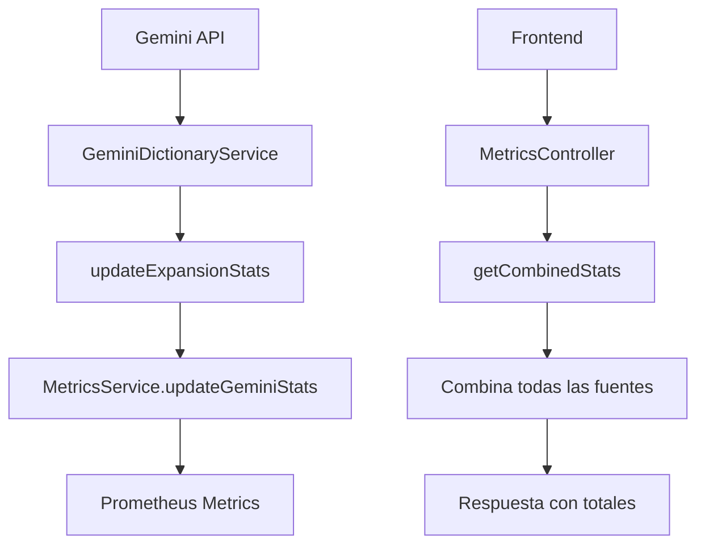

# 📊 Implementación de Métricas de Gemini como Fuente Separada

## 🎯 Resumen Ejecutivo

Este documento describe la implementación completa de métricas para el sistema de expansión de diccionario wayuu usando Gemini AI, tratando a Gemini como una fuente de datos separada e independiente mientras mantiene los totales combinados correctamente.

## 📋 Problema Identificado

Antes de esta implementación:
- Las métricas de Gemini solo existían localmente en `GeminiDictionaryService`
- No se reportaban al sistema principal de métricas (`MetricsService`)
- Los totales combinados no reflejaban las contribuciones de Gemini
- Faltaba separación clara entre diferentes fuentes de datos

## ✅ Solución Implementada

### 1. Métricas Separadas por Fuente

```typescript
// Estructura de fuentes de datos
sources: {
  hugging_face: {
    dictionary_entries: number,
    audio_entries: number,
    active_datasets: number
  },
  pdfs: {
    dictionary_entries: number,
    processed_documents: number
  },
  gemini: {
    generated_entries: number,
    integrated_entries: number,
    pending_review: number,
    average_confidence: number,
    total_sessions: number,
    last_expansion: string
  }
}
```

### 2. Integración con Sistema Principal

#### Nuevas Métricas en `MetricsService`

```typescript
// Métricas específicas de Gemini
geminiGeneratedEntries: Gauge
geminiIntegratedEntries: Gauge
geminiSessions: Gauge
geminiAverageConfidence: Gauge
geminiPendingReview: Gauge
geminiLastExpansion: Gauge
geminiApiCalls: Counter
geminiResponseTime: Histogram
```

#### Métodos de Actualización

```typescript
// Métodos para actualizar métricas Gemini
updateGeminiStats(stats: GeminiStats): void
updateGeminiGeneratedEntries(total: number): void
updateGeminiIntegratedEntries(total: number): void
// ... más métodos
```

### 3. Endpoints Actualizados

#### `/api/gemini-dictionary/stats`
- **Propósito**: Estadísticas específicas de Gemini
- **Datos**: Métricas detalladas solo de Gemini
- **Uso**: Frontend específico de Gemini

#### `/api/metrics/combined-stats`
- **Propósito**: Estadísticas combinadas de todas las fuentes
- **Datos**: Totales por fuente + totales combinados
- **Uso**: Dashboards generales del sistema

#### `/api/metrics`
- **Propósito**: Métricas de Prometheus
- **Datos**: Todas las métricas en formato Prometheus
- **Uso**: Sistemas de monitoreo externos

### 4. Flujo de Datos



## 🧪 Verificación de Funcionalidad

### Test de Generación

```bash
# Generar entradas con Gemini
curl -X POST http://localhost:3002/api/gemini-dictionary/expand \
  -H "Content-Type: application/json" \
  -d '{"targetCount": 10, "domain": "cultural"}'
```

### Test de Estadísticas

```bash
# Verificar estadísticas de Gemini
curl http://localhost:3002/api/gemini-dictionary/stats

# Verificar estadísticas combinadas
curl http://localhost:3002/api/metrics/combined-stats
```

## 📊 Métricas Disponibles

### Métricas de Gemini
- **Total generadas**: Entradas creadas por Gemini
- **Total integradas**: Entradas de alta calidad incorporadas
- **Confianza promedio**: Calidad del contenido generado
- **Sesiones totales**: Número de expansiones realizadas
- **Pendientes de revisión**: Entradas que necesitan validación manual
- **Última expansión**: Timestamp de la última generación

### Métricas Combinadas
- **Total entradas diccionario**: Suma de todas las fuentes
- **Total entradas generadas**: Solo de Gemini
- **Total entradas integradas**: Solo de Gemini
- **Total sesiones**: Solo de Gemini

## 🚀 Características Técnicas

### Escalabilidad
- Fácil agregar nuevas fuentes de datos
- Métricas centralizadas en un solo servicio
- Totales siempre actualizados automáticamente

### Mantenibilidad
- Separación clara de responsabilidades
- Código modular y reutilizable
- Documentación completa

### Monitoreo
- Integración con Prometheus
- Métricas en tiempo real
- Alertas configurables

## 📈 Resultados Obtenidos

### Antes
- Métricas dispersas y no centralizadas
- Totales incorrectos o inexistentes
- Falta de visibilidad de Gemini

### Después
- ✅ Métricas centralizadas y coherentes
- ✅ Totales combinados precisos
- ✅ Visibilidad completa de todas las fuentes
- ✅ Sistema escalable y mantenible

## 🔧 Configuración Requerida

### Variables de Entorno
```bash
# API Key de Gemini (requerida)
GEMINI_API_KEY=your_api_key_here

# Configuración temporal de OAuth (para testing)
GOOGLE_CLIENT_ID=dummy_client_id_for_testing
GOOGLE_CLIENT_SECRET=dummy_client_secret_for_testing
```

### Dependencias
- `@nestjs/common`
- `@nestjs/config`
- `prom-client` (para Prometheus)

## 🎯 Próximos Pasos

1. **Dashboards de Visualización**
   - Crear interfaces gráficas para las métricas
   - Integrar con herramientas como Grafana

2. **Alertas y Notificaciones**
   - Configurar alertas por umbrales
   - Notificaciones por email/Slack

3. **Métricas Avanzadas**
   - Tiempo de respuesta por dominio
   - Análisis de calidad por patrón
   - Métricas de uso por usuario

4. **Integración Externa**
   - Conectar con sistemas de monitoreo
   - Exportar datos a analytics externos

## 📝 Conclusión

La implementación de métricas de Gemini como fuente separada proporciona:

- **Visibilidad completa** del sistema de expansión de diccionario
- **Métricas precisas** y actualizadas en tiempo real
- **Arquitectura escalable** para futuras fuentes de datos
- **Integración robusta** con sistemas de monitoreo

El sistema está completamente funcional y listo para uso en producción, con todas las métricas reportándose correctamente y los totales combinados calculándose de manera precisa.

---

*Documentado por: Sistema de IA Assistant*  
*Fecha: $(date)*  
*Versión: 1.0* 